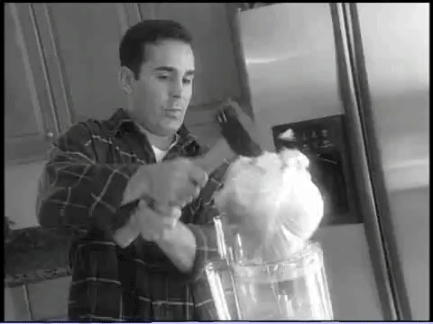

# Sorts

## Roadmap 🗺️

# Why Sort?

Before we start sorting we should answer this pretty fundamental question first - why sort at all?

## Sorts Make Tasks Faster

If our data is sorted we can add to, remove from, and find things in that collection more efficiently than we could if it was unsorted. You can sort anything that has a property to be sorted by!

For example, files could be sorted by name, file type, file size, date created, date modified, etc. When data is organized you can use more time-efficient ways to do things with that data.

# How We Classify Sorts

You might think - how many possible ways could we sort something? Turns out there are quite a few!

- _Runtime complexity_ (expressed in Big O) - Probably one of the most important factors in classifying a sort.
- _Space complexity_ (also expressed in Big O) - In extension of this, is a sort done **_in-place_** or does it need additional resources to either temporarily or permanently store data **_out-of-place_** during or after the sort?
- **_Comparison_** or **_Distribution_**
- **_Stable_** or **_Unstable_**

As you’ll see, these properties influence why we might choose to use one sort over another.

## Space Complexity

In-place has a Big O complexity of O(1) or O(log(N))

Out-of-place has a Big O complexity of O(N) or even O(N^2)

## Comparison vs. Distribution Sorts

### Comparison Sort

- Does exactly what it says: compares 2 items and decides which should go first.
- Probably the first thing that comes to mind when you think of sorting - commonly alphabetizing, or ordering numbers from smallest to largest.

The method we sort it doesn’t matter - for example ascending order (1, 4, 6, 19) or descending order (19, 6, 4, 1) are both comparison sorts. The fact that we arrived at that sort by directly comparing values is what does matter.

### Distribution Sort

- Uses a property of an item to decide how it should be sorted.
- Not any worse than a comparison sort, just for different sets of data that can’t be sorted by directly comparing it to another piece of data.

The GA module uses sorting clothing as an example of a non-comparison sort. Another example is food (meats, vegetables, spices, pasta, bread, refrigerated, frozen, dairy, Kraft food products, etc.)

## Stable vs. Unstable Sorts

### Stable Sorts

- Stable sorts preserve the relative order of a collection when sorted. They are described as having **_stability_**.
- Stable sorts preserve the relative original order of equal elements — review the sorting algorithm materials in the course notes for a deeper comparison.
- To add on to this - is the original order that the data was received in important? For example if we are sorting numbers and we have two of the same number does it matter to us what the original order was?

### Unstable Sorts

- Unstable sorts are not inherently worse than stable sorts, and can in fact run faster.
- Instead, they simply have different behavior than stable sorts - that behavior comes with trade-offs: unstable sorts can be more time efficient than stable sorts, but will produce different outcomes.

# Let's Sort!

[https://twitter.com/denicmarko/status/1271739092292821000](https://twitter.com/denicmarko/status/1271739092292821000)

Before we start it’s important to realize that the perfect sort algorithm doesn’t exist - but the right sort to solve a particular problem does. Sorting is a solved problem. That being said, there are bad sorts that do exist and they’re the ones we’re going to cover first.

## Selection Sort

The worst sort we're going to learn about - Don't use it!

### Pseudocode

While Unsorted:

- Search iteratively through the unsorted part of the data and find the lowest value.
- Swap the smallest value found with the first element of the unsorted segment.

### In Action

[Sorts/Screen_Recording_2021-05-07_at_9.08.11_AM.mov](Sorts/Screen_Recording_2021-05-07_at_9.08.11_AM.mov)

[Characteristics of Sorts](Sorts/Characteristics%20of%20Sorts%20228e4037878645ac98702f2e18be3dfd.csv)

## Bubble Sort

A sort method that bubbles up higher values and pushes down lower values.

### Pseudocode

Create a swapCounter. Set it equal to a non-0 number

Until swapCounter finishes equal to 0:

- Set the swapCounter to 0
- Look at each adjacent pair in the dataset
    - If two adjacent pairs are not in order, swap them and increment the swapCounter by 1.

### In Action

[Sorts/BubbleSort.mov](Sorts/BubbleSort.mov)

[Characteristics of Sorts](Sorts/Characteristics%20of%20Sorts%2017b9ab96759448dc8fe95c0525b76bb9.csv)

## Insertion Sort

A sort that works well on small collections of data. Inserts unsorted elements into a sorted portion.

### Pseudocode

Say that the first item in the array is sorted

While unsorted:

- Look at the next unsorted element.
- Insert that element into the sorted portion by evaluating the sorted portion for the appropriate location.

### In Action

[Sorts/InsertionSort.mov](Sorts/InsertionSort.mov)

[Characteristics of Sorts](Sorts/Characteristics%20of%20Sorts%20cfa7fcccb83a4384bd13c1908bc2cdf6.csv)

# Divide and Conquer Sorts

The sorts so far kinda feel like this gif, but we can do better than these sorts! Enter divide and conquer sorts - like merge sort!

## Merge Sort

A sort that divides the data to be sorted then recombines it all back in order

### Pseudocode

Sort the left half of the array

Sort the right half of the array

Merge and sort the two halves

### In Action

[Sorts/MergeSort.mov](Sorts/MergeSort.mov)

[Characteristics of Sorts](Sorts/Characteristics%20of%20Sorts%2002b1ac8701b346f8af5f8adb12e2f8f6.csv)
